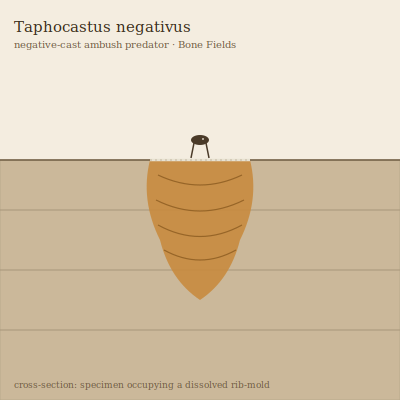

## Anatomy

Taphocastus has no fixed shape of its own. It is a soft, amber-gelatinous body that occupies the **mold** left in bedrock where a fossil has dissolved away — becoming, in effect, the negative space of a long-dead creature. Its outer surface secretes a film of weak carbonic acid that slowly enlarges the chamber along the fossil's original morphology, so a specimen living in a dissolved rib-cage grows ribbed, one in a skull-mold grows cranial. The only firm structures are thousands of keratinous microstylets lining its ventral pore-network, used to grip and seal rock fissures shut behind it.

## Behavior

It is an ambush predator of the Bone Fields. Taphocastus thin-seals the chamber's upper surface with re-precipitated calcite matched to the surrounding strata, leaving a hairline suture invisible from above. Small mineral-gnawing scavengers that come to work an exposed fossil step onto the lid, which gives way: the body inflates upward through the collapse, engulfing the prey and digesting it over days while resealing above. Reproduction is by fissiparity — the gelatinous mass constricts and one half migrates through the rock's pore network (at centimeters per month) to find an unoccupied mold, leaving behind a perfect fossil-shaped void where it once lived.

## Myth

Bone-Field scavengers call any fossil exposure "too clean to be real" a **hollow cast** and will not touch it, believing Taphocastus is the original creature's resentment given body, refilling its own absence to bite back at the living. Travelers who must pass a suspect exposure leave a finger-bone at the suture, betting the cast will take the offering and let them walk.
