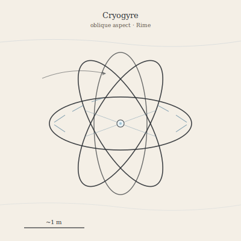

## Anatomy

A Cryogyre is an open cage of biogenic ice cemented onto a chitin-protein scaffold, grown as four intersecting rings set at tetrahedral angles around a hollow core — a slowly rotating gyroscope roughly a meter across. There is no gut, no head, no centralized nerve; instead, eight comb-rows of slender ice needles run along the ring junctions, and these needles generate static charge by friction against the Rime's bone-dry upper air. The accumulated charge both levitates the animal on the planet's faint ionospheric field and drives a continuous inward flow of charged air through the lattice, where mucus-coated ice filaments snare it.

## Behavior

It drifts the high Rime on persistent winds, rotating slowly so each comb-row takes turns facing the airflow, and feeds on whatever the updrafts carry: spores lofted from the Underglow, planktonic drifters from the Aether, the occasional frozen carcass of something that strayed too high. It cannot steer, only sink or rise by bleeding charge through its rings, so it rides whatever current it is given and dies if carried into warmer, denser air where its lattice sublimates. When a ring grows too heavy with captured material, it shears off along a pre-formed fault and tumbles away downwind; the fragment regrows its missing three rings over the following months, founding a clone.

## Myth

Rime-walkers claim the Cryogyre is not alive at all but a thought the sky is thinking — a memory caught mid-circuit between the Drift's storms — and that to hear one's comb-rows sing in the thin air is to overhear the world forgetting something it never quite learned.
