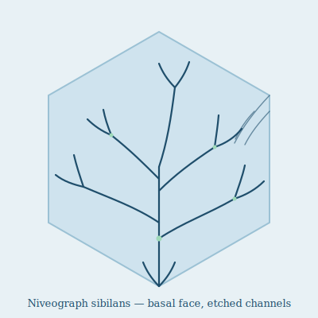

## Anatomy

Niveograph is not so much an animal as a living etching: a syncytial film of cytoplasm, one cell thick and a few millimeters across, spread across the basal faces of Rime ice crystals. Its body is the absence of ice — a branching labyrinth of saline microchannels that the organism dissolves and refreezes around itself as it moves, so the creature and its tunnel-system are the same object. There is no gut, no symmetry, no mouth; nutrients from wind-stranded organics and dead aeroplankton diffuse straight through the channel walls, which are lined with a ciliate film and a brine of glycopeptide antifreeze kept liquid forty degrees below freezing. A faint mint-green pigment in the cytoplasm — a relic chlorosome — flickers under UV scatter, the only visible sign of life.

## Behavior

It crawls by extending a new channel tip, melting a hair's width of ice with concentrated brine, then sealing the wall behind it with a refreeze signal; top speeds are measured in centimeters per day. When two Niveographs meet, their channels fuse and cytoplasm mingles, exchanging nuclei and doubling the labyrinth's reach — a single individual can become a square-meter continent of merged tissue over a season. It grazes the slow snow of the upper atmosphere, filtering aeroplankton husks and meteoric dust from the ice surface. When the crystal it rides on sublimates away, the tissue dessicates into a spore-like flake that drifts to a fresh ice face and rehydrates; this is how the Rime stays seeded even where no living film could walk.

## Myth

Rime-cartographers prize slabs etched by old Niveograph colonies as "speaking ice," believing the labyrinth holds a map of every wind that ever crossed the upper Drift; a few monasteries keep thawing-rare copies under glass, claiming to read weather a century gone in the channel bends.
