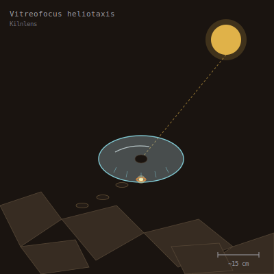

## Anatomy

A biconvex disc of biogenic silica, 12–18 cm across, optically clearer than any cut gem — grown layer by layer from vapor-phase deposition, like a pearl built from light instead of grit. The only opaque feature is a central nucleoid of magnetite-stained tissue that doubles as the animal's gut and ganglion. Hydrostatic pressure across the disc's two faces tunes its curvature in seconds, so the lens can shift focal length from a few centimeters to several meters. There is no mouth; the underside is a nap of silica spicules that wick dissolved material inward.

## Behavior

At zenith the Kilnlens faces the sun and focuses its beam to a sub-millimeter point on the desert crust, vaporizing a pit in the glass. The escaping jet of superheated silica pings the disc sideways — a single hop of centimeters to a meter — and as it skims the still-molten rim, the spicules mop up the leached trace metals (iron, chromium, vanadium) that the heat has drawn out of the matrix. Feeding and locomotion are the same act. It leaves a chain of tiny dimpled craters that always trace the sun's azimuth across the wastes. When the nucleoid grows too dense with accumulated metal, the disc cleaves radially into two half-lenses; each regrows its missing half over weeks, faintly asymmetric for life.

## Myth

Glass-waste nomads steer by Kilnlens trails, calling them "the sun's handwriting" — but they will throw a dark mat over a downed companion if one drifts close, because a focused Kilnlens can sear a hand to bone before the bearer blinks.
