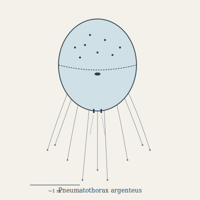

## Anatomy

A rigid ellipsoidal shell of biogenic silica-aerogel roughly a meter long, internally evacuated to near-vacuum by membrane-bound metal-ion pumps, giving the whole creature net positive lift in the Drift's lower Aether. The outer surface is a nacreous photosensitive integument studded with hundreds of tiny dark photophores that track the sun for thermal steering. From a serrated equatorial suture hang thirty to fifty trailing filaments — charged chitin threads, glassy and barbed — and at the shell's base opens a single gastric pore ringed in ciliated lip. There is no head, no eyes, no bilateral symmetry; the animal is a floating stomach with a mane.

## Behavior

It drifts the Aether at altitudes where aerial plankton and small fliers concentrate, orienting shell-to-sun to ride thermals. When a prey cloud is sensed (by the filaments' static response), it vents stored gas through two posterior nozzles — a biological cold-gas sprint — and tacks through the cloud, filaments trailing and stunning microfauna with 200-volt pulses. Cilia draw catch up into the gastric pore. It cannot land; to rest it equalizes internal pressure, sinks to a neutral buoyancy layer, and hangs motionless for days. Reproduction is equatorial fission: the shell splits along its suture, each half regrowing the missing hemisphere over a season behind a temporary gas bladder that keeps it aloft.

## Myth

Skyfarers call it the **weather-egg**, believing each argenteus hatches fully formed from the eye of a storm. The dark photophore-spots on its shell are said to be the wind's memories, and a sailor who recites them in order — impossible, they move — can summon a following wind for the rest of the crossing.
