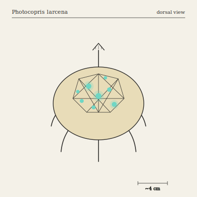

## Anatomy

A low domed body the size of a closed fist, carried on six jointless hydraulic lobopods and roofed in a tessellated carapace of amber chitin — each polygon a deep socket with a pore at its base. P. larcena has no eyes; instead the sockets host living grafts excised from the Underglow's luminous fungi, kept alive on hemolymph that weeps up through each pore. A mature animal carries eight to thirty grafts at once, a stolen constellation that shifts as old grafts dim and new ones are pressed into empty sockets. Underneath, a conveyor of rasping plates scrapes fungal mats from rotting world-wood; the radula is the only hard mouthpart, and it never stops cycling.

## Behavior

It grazes slowly across fallen canopy timber, shearing off the glowing fruiting bodies of the mats it feeds on and selecting the brightest to press into empty carapace sockets, where the hyphae re-anastomose with its hemolymph and keep glowing for weeks. The constellation serves three uses: a flash-bang startle when disturbed, a slow pulse during mate-finding (each animal's rhythm is as individual as a fingerprint), and a faint photosynthate trickle from the grafts that supplements its diet. Pairs do not mate directly — they exchange grafts, pressing carapaces together so hyphae bridge between animals before separating. When an individual dies the grafts often survive it, seeding a fresh fungal ring on the carcass; many Underglow groves are, at their center, a dead Photocopris.

## Myth

Underglow foragers claim that if you lie still in the dark long enough, a Photocopris will walk across you and press a graft into your skin — and the spot will glow faintly for the rest of your life, marking you as someone the forest has accepted rather than merely tolerated.
