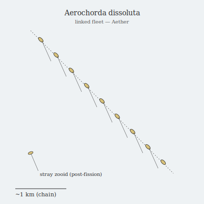

## Anatomy

Aerochorda is not one animal but a fleet: ten thousand hair-thin zooids, each a translucent chitin filament thirty to ninety meters long with a pear-shaped hydrogen bladder at the apex and a phyllode strip down its length running photosynthesis on the Drift's thin scattered light. The zooids carry no brain, only a stretch-sensitive piezo nerve. In calm air they drift singly and are nothing — but in wind shear between landmasses they dock edge-to-edge via electrostatic zippers, their piezo nerves fusing into a single continuous conductor, and the fleet becomes one creature: a drifting ribbon-kilometer long that orients its filaments like a feather to hold station.

## Behavior

It feeds by spreading the chain across a current and letting the phyllode strips photosynthesize while sieving charged aerosol dust out of the thin air. The chain's coherence is its life and its risk: a coordinated ribbon can hold altitude against a crosswind, but a lightning strike anywhere along it unzips the whole fleet in a fraction of a second, scattering zooids kilometers downwind. Each zooid then descends alone into denser air until it can recharge its bladder and re-climb. Mating is the reverse — two chains that brush in a storm exchange zooids at the seam, and any chain longer than ~2 km sheds a dense knotted "spore-tangle" that sinks into the Canopy to germinate fresh filaments on the bark of world-trees.

## Myth

Aether-crossers claim the long ribbons are not animals at all but the Drift's own thoughts, briefly strung together between landmasses and unmade the instant the world is startled. Sailors who survive a storm will not speak of the chains they saw, fearing that naming one aloud is what makes it dissolve.
