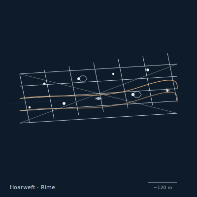

## Anatomy

The Hoarweft's only living tissue is a sparse protein filament core — kilometers of hair-thin strand suspended across thermal shear in the upper atmosphere, weighing under a kilogram despite spanning hundreds of meters. Around this core the colony nucleates atmospheric water vapor into hair-ice, building a frosted mesh that is structurally the "body" but chemically just weather: 99% of any individual is deposited ice, replaced daily by the same air that would kill anything else. There is no head and no gut; the strand core is simultaneously nerve and intestine, absorbing trapped particles directly through its wall. An individual can be melted down to bare core and re-grown intact in the next cold pocket.

## Behavior

It orients its net across the boundary where Rime air meets warmer updrafts, intercepting windblown microfauna and ice-mites that freeze onto the mesh on contact. Steering is by selective sublimation: the creature salts certain filaments with a freezing-point-depressing protein, melting them to shed ballast and tilt the whole web into a new current. Reproduction is fragmentation — a saturated segment, heavy with trapped prey, snaps free at a sacrificial node, rides the jet to a fresh thermal shear, and re-nucleates from its core alone. A Hoarweft has no lifespan; it ends only when its entire core is shattered by hail or sheared apart by storm.

## Myth

Rime-folk say the Hoarweft is the sky's memory — each frost strand a thought the upper air tried to keep but could not hold, and a person who walks through one unseen will forget the thing they most wanted to remember. High-drift sailors watch for their shimmer as a marker of thermal boundaries, and never light a fire beneath one.
