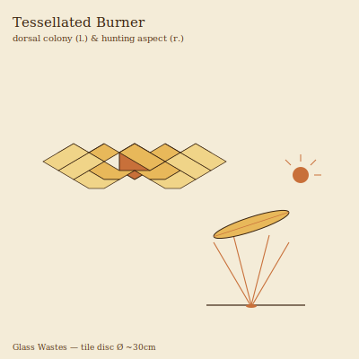

## Anatomy

A flat disc the breadth of a dinner plate, made of several hundred hexagonal calcite tiles fused at their edges into a single flexible Fresnel lens. Each tile is a separate zooid with its own pore, hinge-muscle, and a thread of neural tissue linking it to a decentral nerve ring; there is no head, no gut, no symmetry beyond the hex packing. The underside is a naked, ciliated sole with a central stomodeal foot, and the upper surface is optically polished by a waxy secretion the colony wipes across itself each dawn. The whole animal is, in effect, one continuous compound eye aimed permanently at the sky — and a weapon aimed at the ground.

## Behavior

It hunts only on clear days. The Burner creeps to the sunward face of a glass dune, parks, and tilts its tiles in concert to focus a finger-thin beam of refracted desert light onto the scorch-flat where smaller creatures shelter from the heat. The focal point reaches temperatures that split carapace and flash-boil hemolymph; the Burner then slides down the dune on its ciliated sole and extrudes the stomodeal foot into the cooked carcass, digesting externally over an hour. It navigates between kills by reading the polarization of sky-glare off the glass crust, homing on the patches of brightest scatter where prey congregate. When two adults cross paths they stack, exchange tiles, and the lower disc's oldest rings detach and curl into shallow gliders that ride thermals out of the Wastes to found new colonies.

## Myth

Glass Wastes nomads refuse to wear polished metal under open sky, believing a stray reflection will draw a Burner's focal point "like a thrown stone." A patch of vitrified sand in a perfect ring is read as a Burner that missed its shot and cooked the ground beneath itself — a sign to move camp before the sun climbs higher.
