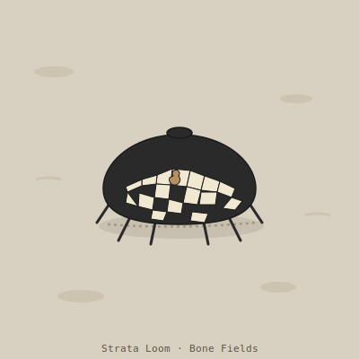

## Anatomy

A flat, hand-sized detritivore built like a mobile acid-vat: six stubby chitin legs, a ventral phosphoric-acid gland that wets the substrate beneath it, and a dorsal carapace that is not secreted but *assembled*. The loom's gut is a slow percolation column that separates dissolved calcium phosphate (absorbed for metabolism) from intact fossil bone fragments (rejected, routed up a ciliated channel, and cemented onto the back with a calcite mortar). The carapace is therefore a growing mosaic, oldest fragments near the center, newest at the rim — a stratigraphic record of everything the loom has eaten.

## Behavior

It migrates alone along exposed fossil beds, dissolving a shallow trench as it goes, and is near-invisible when flattened: the mosaic reads as just another outcrop. Mating is a "library exchange" — two looms meet, chemically taste one another's dorsal fragments, and if compatible each peels a single chip from its carapace and cements it onto the other's rim, a lateral transfer of both mineral and the dietary memory encoded in it. A larva hatches inside a large fossil cavity and dissolves its nursery from within over months, emerging with a starter mosaic of its host's bone.

## Myth

Bone-field scavengers call the loom "the archivist" and hold that each carapace holds the souls of creatures that died in the Drift's first age; to crack one open is to scatter a hundred ghosts. Scholars pay dearly for intact dead carapaces, reading their fragment sequence as a fragmented history of life older than any record the Drift keeps.
