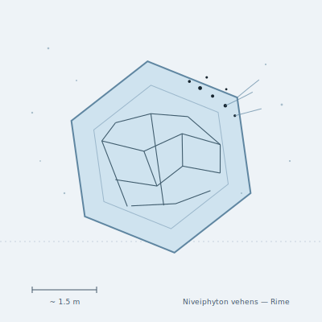

## Anatomy

A single tabular hexagonal plate of biogenic ice up to two meters across and thin as a fingernail, nucleated around a seed protein and grown as one crystal — the Drift's only macroscopic animal with no soft tissue of its own. The organism lives only in the lattice defects: a lacework of brine channels too salty to freeze, threading the plate and carrying ions like a nerve net. The interior ice is dead scaffold the animal carries for free; the creature is the boundary, not the body.

## Behavior

It orients broadside to the UV flux, and migratory pigment granules accumulate along the brine channels at the sunward edge, where they absorb radiation, sublimate the ice, and vent the vapor through microscopic nozzle-pores — a slow cold thruster that tacks the plate across the Rime like a sailboat beating to windward. It feeds on the photochemical aerosol snow precipitating out of the upper atmosphere, trapping organics in fresh ice grown on its shadow face, then digesting them as the brine channels migrate inward. Reproduction is storm-fragmentation: high winds crack the plate along grain boundaries and each shard, if it carries a living edge, regrows a new hexagon over the following drift-season.

## Myth

Rime-fishers say that on still cold dawns you can hear the plates tack — a faint ringing like tapped glass — and that the sound is the creature choosing which way to fall, because a Niveiphyton never lands. To touch the warmer air below the Rime is to melt, and a melted plate is the only death the Drift offers that leaves no body at all.
