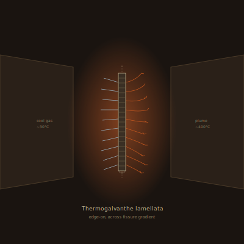

## Anatomy

A flat ribbon thirty centimeters long and four wide, clamped edge-on across the throat of a vent fissure where 400°C plume gas meets cold Drift atmosphere. The ribbon is not tissue: it is a self-assembled thermoelectric stack of several hundred biogenic lamellae, alternating bismuth-rich and selenide-rich sulfide glasses secreted by a monolayer of archaeal cells along the cool face. The whole animal is a thermocouple — the 380°C gradient across its body drives a steady current through the stack, and that current *is* its metabolism: no gut, no mouth, no circulation, only the electron flow harvested from heat. A fringe of black dendritic wires trails into the plume on the hot side and a palisade of crystalline needles stands into the cold gas on the other, the two electrodes that complete the circuit.

## Behavior

It ratchets along fissures by thermal creep: the cool-face cells pulse antifreeze protein to locally delaminate a lamella, the hot side bows forward on expansion, and re-adhesion locks a step of perhaps a millimeter per thermal cycle — so it migrates at the speed of the vent's own breathing, tracking the gradient's peak over days. It feeds on dissolved metal sulfides in the plume, reducing them onto its hot electrode to thicken the stack and excreting silicate slag as a brittle waste rim it sheds monthly. Reproduction is electrotyping: an adult tilts a fresh substrate (a chip of native bismuth, a dead conspecific's stack) against its cool face and, over weeks, plates a mirror-copy of its own lamellar sequence onto it using its own current — the offspring is a metallic cast that then seeds its own living cell monolayer and detaches. A single Thermogalvanthe can cast three or four daughters before its stack sags out of the gradient and it starves, still conducting, in the dark.

## Myth

Vent-divers call it "the candle that casts itself" and swear a living stack will dim if you speak to it — the cells sense vibration as a perturbation in the gradient. A cast daughter, still untarnished, is said to hold the mother's last thermal reading; deep-vent cartographers carry them as compasses that point not north but toward the hottest nearby fissure.
