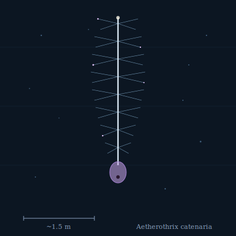

## Anatomy

A rigid spine of poled electret-protein one to two meters long, bristling along its length with thousands of hair-thin filaments that give the whole animal the look of a wire bottle-brush. There is no gut in the vertebrate sense: the filaments are the feeding surface, each coated in a hygroscopic mucus that electrostatically precipitates aerial plankton out of thin air, wicking the catch down spiral ciliated grooves to a single mouth and stomach at the heavier, clubbed base. The spine is permanently charged at birth — a biological electret, poled once during embryogenesis and never recharged — and it is this charge, repelling against the Drift's ionized upper atmosphere, that holds the animal aloft. It weighs less than a seedpod and is taller than a child.

## Behavior

Aetherothrix drifts the high currents between landmasses, rising through the day as solar charging of the ionosphere intensifies the repulsion and sinking slowly after dusk as leakage bleeds its field and it loses lift. It does not fly so much as fall in chosen directions: by selectively discharging filaments along one flank through tiny corona sparks, it tips the spine and glides on the resulting imbalance. It feeds continuously on the thin rain of lofted Canopy spores, mites, and the smaller aether drifters, reeling them in off the bristles like a trawler working an invisible sea. Mating is capacitive — two spines drift close, brush filaments, and exchange gamete packets across a single visible spark that briefly equalizes their charge; the partners then separate, both slightly lower in the sky than they were before.

## Myth

Aether-crossers say the sparks of mating Aetherothrix are the only honest language left in the Drift: two strangers meeting mid-air, giving up half their height to say exactly one true thing, and parting without further ceremony. Children born on the long crossings are told to watch for the sparks and make a wish that costs them something.
