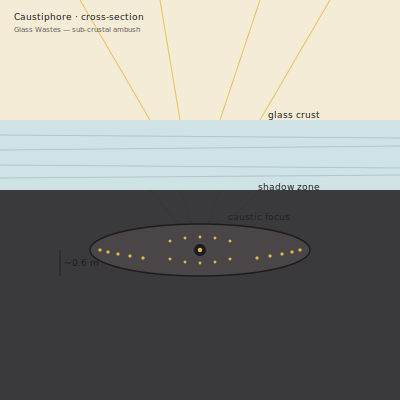

## Anatomy

A flat, lens-thin disc of dark mineralized tissue the width of a sprawled human arm, pressed permanently against the underside of the Glass Wastes' crystalline crust. Its dorsal surface is featureless and silica-fused for camouflage; its ventral surface — the side facing down into the cool shadow beneath the crust — is a dense mosaic of several thousand pinhead photoreceptors, each tuned not to form an image but to track the shifting network of bright caustic lines that sunlight draws as it refracts through the irregular glass above. There is no head, no mouthparts: the animal's margin is a ring of contractile cilia and a single expandable sphincter at the center, through which the gut everts upward like an inverted fist when prey is taken.

## Behavior

The Caustiphore reads the crust the way a spider reads a web. Anything walking on the glass above — a forager, a straying hatchling — disrupts the caustic pattern with its shadow and its weight, briefly bending the light lattice; the venter triangulates the disturbance in under a second and the sphincter punches upward, puncturing the softened crust directly beneath the prey with a column of gut tissue that wraps, dissolves, and retracts the meal back below the surface in a single motion. Between kills it is motionless for weeks, slow-growing and slow-aging, fertilizing the glass above it with mineral-rich exudates that keep its local patch of crust optically complex — and therefore informative. It seeds offspring by releasing mineral-coated spores into the thermal updrafts that sweep the Wastes at dusk; those that settle on young, thin crust found their own disc.

## Myth

Glass-waste caravans speak of the desert that watches back. To them the Caustiphore is not many animals but one — a single vast mind pressed like a lining against the underside of the world, reading every footstep the Wastes have ever received, and patient enough to wait a lifetime for any single shadow that offended it.
