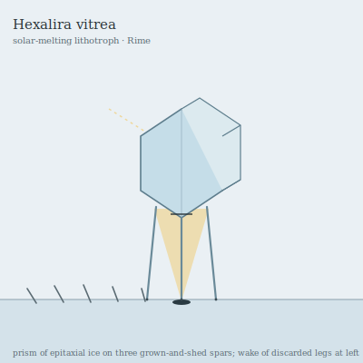

## Anatomy

A single hexagonal prism of optically clear ice, grown by epitaxy over decades, forms the entire dorsal structure — the creature's own tissue is a sub-millimeter film of cryo-protein lining each prism face, no thicker than frost. Three telescoping ice spars project from the base as legs, continuously grown at the tip and shed at the foot, so Hexalira walks on its own skeleton and discards it behind. The ice is the body; the organism is barely a skin on its surface.

## Behavior

It orients the prism to the sun and focuses light through its body onto the Rime below, melting a pinhole pit that exposes aerolithic minerals and frozen phototrophs sealed in the lattice — these it vacuums up through a basal slit, cracking them with cold-acid secretions. A specimen never crosses its own spicule-wake, reading the discarded spars as a map of where the ice is already mined. When a prism fractures, any fragment still bearing a face of tissue regrows a complete new prism over years, re-aiming itself to the new sun angle; storms thus produce cohorts of smaller, parallel-oriented offspring.

## Myth

Rime travelers read the direction of Hexalira wakes as the bones of the sky — a record of where the sun has paid its debts. A prism found standing alone at dawn is called a sky-clerk, and to break one is to scatter the record; the remorseful leave an offering of exhaled breath on the shard, which the clerk is said to fold back into its ice.
