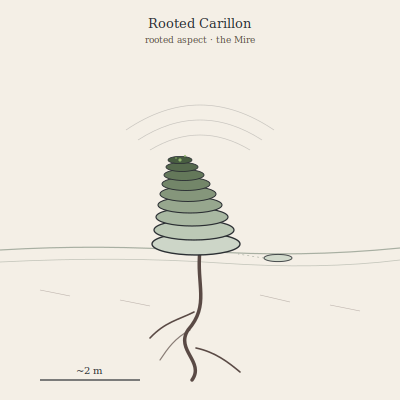

## Anatomy

A helical stack of seven to forty keratin-chitin rings rising one to three meters above the Mire waterline like a leaning spiral bell-tower, each ring a separately-pitched closed pipe whose length is fixed the season it was grown. Below the waterline a single convoluted siphon-root — a gut lined with methanotrophic archaea — plunges meters into anoxic sediment, drawing up methane and sulfide it oxidizes for all its energy. Spent gas, stripped of its chemistry, vents upward through the rings; the root is the mouth and the bells are the exhalation. There is no head, no eye, no symmetry but the spiral.

## Behavior

Sessile after rooting, it sings continuously — a chord of its whole stack, modulated by gas-flow rate, which it varies by contracting the root in response to a neighbor's vibration. Two Carillons within earshot drift toward each other over days until their chords share a common tone; once that tone holds a full season the lowest three or four rings of each soften, slough off, and float away on the Mire to root elsewhere. The offspring inherit no pitch, only the growth-rule, so a lineage never repeats its sound and each new neighbor-match re-tunes the descent from nothing.

## Myth

Mire-folk navigate the fog by ear, mapping whole districts by which chord comes from which bearing; a Carillon gone suddenly silent means its neighbor has fallen somewhere in the murk you will never see. Travelers who sleep inside a chorus report the chord continuing in their own chest for days after leaving, as if the root had briefly sunk into them.
