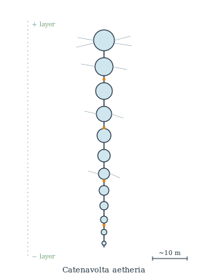

## Anatomy

A vertical chain of 40–120 translucent gas-bladders (pneumatocysts) linked by a single conductive nerve-cord, hanging 20–60 meters top-to-bottom across the Aether's charge gradient. The headmost cyst rides the positively-charged upper skin of the air column; the tailmost sinks into the negative lower shear, and the potential between them — sometimes exceeding 800 volts — is the colony's sole energy source, tapped at metal-sulfide nodes spaced along the cord. There is no mouth or gut: carbon and trace mineral are gleaned from a fuzz of charged capture-threads trailing each cyst, which snare aerial plankton and wind-borne dust and are reabsorbed into the bladder wall.

## Behavior

It never lands and cannot — collapse the gradient and the whole chain falls. Lateral travel is by tacking: asymmetric gas-venting tilts the chain so wind shear between two density layers pushes it sideways like a sail beating upwind, and a colony can hold station against a drift-current or cross between landmasses over weeks. Reproduction is galvanic fission — when resistance at one node rises past threshold (usually mineral fouling), the cord severs there; the free segment equalizes charge with its surroundings, sinks or rises until it spans fresh layers at the right spacing, and regrows head and tail.

## Myth

Aether-crossers call a calm gap between landmasses "dead air" only half in jest — where the voltaic chains have gone silent, the charge gradient has collapsed and no sail or wing will carry. Pilots who must cross anyway trail a copper wire astern; if it sparks against the hull, the chains still live somewhere below and the passage is safe.
