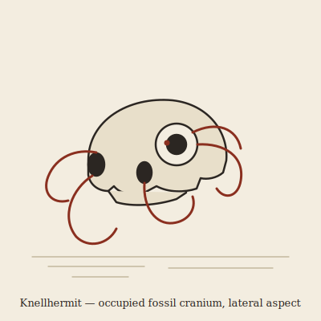

## Anatomy

A soft cephalopodic body — mantle, chitin beak, eight hydrostatic tentacles — with no skeleton of its own. It occupies a hollowed fossil skull: acid from a submantle gland dissolves the marrow cavities until the cranium is a thin-walled resonant shell, then the animal wedges itself inside and threads two tentacles out through each natural foramen (orbital, optic, nasal, and the foramen magnum) to serve as legs and arms. A hardened chitinous knob rests against the inner vault of the skull and can be struck like a clapper. The animal is, in effect, a soft pilot wearing a dead thing's head as both armor and instrument.

## Behavior

An ambush carnivore. It buries the occupied skull flush with the badland dust, leaving only the fossil's orbital rims exposed as a lure; when a scavenger probes the "eye," tentacles erupt from every foramen at once and fold the prey back through the foramen magnum into the mantle sac to be beaked. Knellhermits are lithophonic: they rap the inner vault to broadcast territory and shell-size, and because each fossil species resonates at a different pitch, a caller advertises its cranium as clearly as its body. Every few seasons the animal outgrows its skull and must molt — a naked, dangerous crossing of the bonebeds to find and hollow a larger cranium, during which it is silent for the only time in its life.

## Myth

Bone Field wayfarers say the Knellhermits are the Drift's undertakers, wearing the dead because the dead still owe a hunger. A fossil skull that rings when struck is occupied, and to take one is to inherit what lives inside it; such bones are left where they lie, even when they lie across a traveler's only path home.
