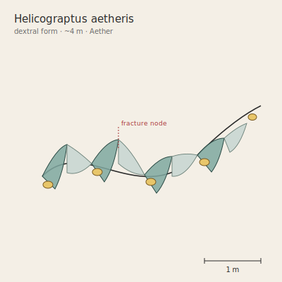

## Anatomy

A three- to ten-meter helical ribbon of translucent chitin, one cell thick, kept aloft by a single row of ammonia-filled gas bladders along its leading edge. There is no head, no gut, no front or back — only a handedness (dextral colonies are roughly twice as common as sinistral). The ribbon's entire trailing surface is a ciliated sieve net, and the chitin is doped with piezoelectric salts that build a triboelectric charge as the helix rotates. A blunt nervure runs the length of the ribbon's spine; at evenly spaced nodes the nervure is pre-weakened, a designed fracture line.

## Behavior

Helicograptus lives entirely in the open Aether, never touching land. Wind shear between altitude layers catches the helical ribbon and spins it like an Archimedes screw — the rotation is not propulsion but feeding, driving aeroplankton and wind-borne spores across the ciliate sieve where they're absorbed. Prey large enough to escape the sieve are stunned by a discharge from the piezoelectric surface, then drawn in by reversed ciliary action. It navigates altitude by adjusting bladder pressure, sinking at night to denser, spore-rich layers and rising at dawn to sun-warmed thermals. Reproduction is fracture: at a pre-weakened node the nervure snaps in high wind, the two helical halves spiral apart, and each regrows the missing portion over weeks from a meristem at the break.

## Myth

Aether navigators read Helicograptus coils the way sailors read currents — a dextral colony means a clockwise weather cell, a sinistral one its mirror — and pilots will alter course off a lone ribbon's handedness alone, calling them "wind-hands." Among the cloud-fishing clans a sinistral individual seen coiling against its cell is an ill omen, said to be a soul that refused to settle after death and is still searching for the landmass it fell from.
