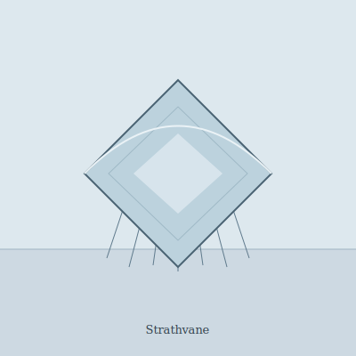

## Anatomy

A rigid diamond pane of biogenic ice, 1.5–2 m across, grown around a protein lattice of the organism's own secretion and kept from shattering by a glycolipid antifreeze laced through the crystal grain. There is no body proper — only the pane, a flat icicle turned horizontal. The ventral surface trails a curtain of half-meter rime-needles, grown continuously from sublimation-fed dew and snapped off when overloaded. Contractile melt-veins run along the long axis: by locally thawing and refreezing the leading edge, the strathvane trims its own airfoil and holds a stable angle of attack in the thin Rime wind.

## Behavior

It never lands. A strathvane rides pressure differentials between the upper Canopy and the Rime, tacking by melting a few millimeters of one corner and letting it refreeze canted, so a single individual may circle a landmass for decades. It feeds by flying slow and level through upwelling plumes of aerial plankton shed from the Canopy below; the rime-needles impale them, and a cryo-enzyme creeps down each needle to liquefy the catch into the pane's hemolymph channels. Reproduction is by scored fracture: at maturity the pane develops a fault line, and a strong gust splits it cleanly; each half regrows the missing triangle over a season by seeding moisture onto the exposed edge.

## Myth

Rime-walkers say a strathvane is a thought that the upper air could not finish — a kite that the wind forgot to reel in. To see one break apart overhead is an omen of a long journey ending in two shorter ones, neither of them yours.
