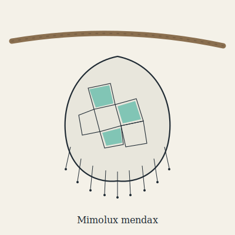

## Anatomy

A flat, translucent leaf-shaped body the size of a spread hand, rimmed with a fringe of hair-thin ventral photoreceptors and backed dorsally by a living mosaic of chromatophore cells charged with fungal-fluorescent proteins sequestered from its diet. There is no centralized mouth: the entire ventral surface is a single adhesive-enzyme pad that lands on prey and digests it in place, drawing the liquefied remains up through the same surface. The nervous system is essentially a relay — incoming light patterns on ventral receptors drive the dorsal mosaic within milliseconds, with almost no central processing — so the whole animal functions as a living optical repeater, reading light with its belly and writing it with its back.

## Behavior

Mimolux glides between world-wood limbs on a ciliated fringe skirt, settling wherever the fungal hyphae are densest and clamping flat against the bark. The Underglow's fungi flash to one another in chemical alarm cascades, and Mimolux inserts itself into that network: by replaying intercepted flashes with subtle alterations — delaying an alarm here, injecting a false all-clear there — it both cloaks its own silhouette and reshapes the traffic of small detritivores that navigate by the forest's light, herding them onto its pad. It mates by synchronized flash duets, two animals mirroring each other's spoofed signals until the patterns converge and they drift together ventral-to-ventral to exchange gamete packets; the offspring hatch already seeded with fluorescent protein stolen from the parent's last meal.

## Myth

Underglow foragers say the forest has a language, and Mimolux is the only thing that learned to lie in it. A grove where the flashes seem off — too slow, wrongly timed, answering questions that were never asked — is a grove being hunted, and the wise traveler leaves by touch alone, never by light.
