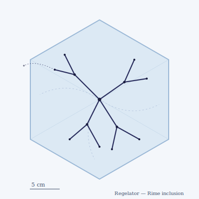

## Anatomy

A vitreous, gel-filled organism that lives not on the Rime but *inside* it — an inclusion sealed within a single clear ice crystal, like a fossil in amber. Its body is a flattened, branching network of transparent glycoprotein tubes, ~40 cm across, pressed thin along the crystal's basal plane. No mouth, no gut; the tube walls are lined with cells packed with a dark antifreeze pigment that harvests the faint Rime light piped to it through the host crystal, the ice itself acting as a planar waveguide. Because the creature is sealed in, it never touches open air in its adult life — it is a swimmer in a solid.

## Behavior

It moves through solid ice by regelation: glands at the leading edge secrete a cryoprotectant and apply hydraulic pressure, depressing the freezing point and melting a pocket a few millimeters ahead; the pocket refreezes behind as the body advances, so the animal bores a healed tunnel that leaves no void. It hunts by the strain shadows other inclusions cast through birefringent ice, orienting on the polarized fringes of frozen aeroplankton and smaller ice-bound organisms, then engulfs them by growing a tube around the trapped prey and digesting it in situ. Mating never involves meeting: two Regelators exchange genetic material by extending hair-thin gel probes through the ice toward each other's strain signatures, fusing nuclei across centimeters of crystal without either ever leaving its own sealed gallery.

## Myth

Rime-navigators call it the ghost in the glass — the Drift remembering the shape of something it froze in a colder age. Upper-air sailors read its birefringent shadow when it crosses a sextant mirror: once, and the bearing is true; twice, and the ship is already lost and has not yet noticed.
