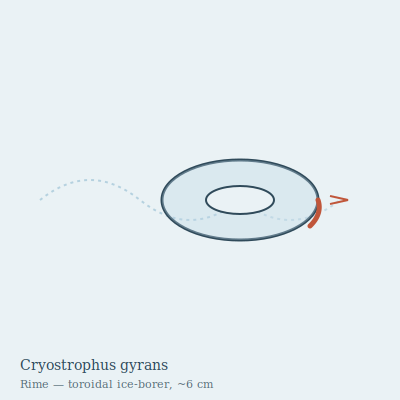

## Anatomy

A living torus the diameter of a closed fist, cross-section no thicker than a thumb: a ring of clear, gelatinous tissue seeded with a lattice of self-grown ice crystals that make it nearly indistinguishable from the Rime it inhabits. The outermost rim is a band of densely ciliated epithelium laced with a glycopeptide antifreeze and a mitochondrial hot-strip that runs three degrees above ambient; this is the boring edge. The inner lumen of the torus — the hole — is a ciliated filter-gut lined with adhesive mucus. There is no head, no symmetry axis beyond the ring itself; the animal is its own track.

## Behavior

Cryostrophus rolls through the Rime the way a washer rolls along a wire, except the wire is ice it must manufacture ahead of itself and dismantle behind. The hot leading rim melts a channel just wider than its body; the liberated meltwater — charged with the slow rain of frozen aeroplankton, stray spores, and wind-killed insects fallen up from the Canopy — is drawn through the lumen, stripped of organics by the mucus gut, and excreted as near-pure water out the trailing rim, where ice-nucleating proteins re-freeze it in seconds. The animal therefore leaves no tunnel, only a faint helical scar of slightly clearer refrozen ice that the Rime's keepers learn to read. It cannot reverse; to change direction it must halt, re-grow a hot strip on the opposite inner face over several hours, and begin boring the other way. Reproduction is by radial fission: the ring constricts at one point, thins to a filament, and separates into two smaller tori that each re-grow to full size over a season of feeding.

## Myth

Rime-keepers insist the helical scars are not trails but letters, and that a Cryostrophus long enough to close a loop around an entire ice-mass would inscribe a single sentence the cold has been trying to finish since the Drift froze. They will not break a refrozen scar, even to harvest clear ice, for fear of cutting the word mid-stroke.
