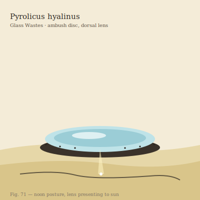

## Anatomy

A flattened chitinous disc the width of a dinner plate, its dorsal surface domed by a single biogenic silica lens it secretes and re-polishes daily with a wiping fringe, ground optically smooth as a telescope objective. There is no mouth: the lens *is* the weapon and the eye. A ring of photoreceptive cells around the disc's rim images the world inverted onto itself, and by tilting the whole disc on a skirt of ciliated podia the animal steers its focal point across the sand like a beam on a gimbal. The underside is a dark, velvety mat of symbiotic thermoacidophilic microbes — its gut, farmed externally.

## Behavior

Pyrolicus buries its rim flush with the dune crest at the angle of the noon sun and waits motionless, lens presented to the sky. Anything that crosses the focal cone — a foraging hopper, a wandering lithotroph — is ignited in a single breath of white light; the charred carcass is then dragged beneath the disc and the microbe mat dissolves it over hours into sugars the animal absorbs through its skin. It mates by lens-grafting: two discs press rims together and exchange microbial swabs, each leaving with a new strain. When a lens grows too large to steer it fractures along a deliberate stress line and each half walks off to regrow a center.

## Myth

Glass-waste caravans mark Pyrolicus territory by the burn scars it leaves on the sand — long, impossibly straight char-lines that wander and double back. They say the lines are not hunting trails but the creature's handwriting, and that the oldest Pyrolicus has been writing the same unfinished sentence for a thousand seasons.
