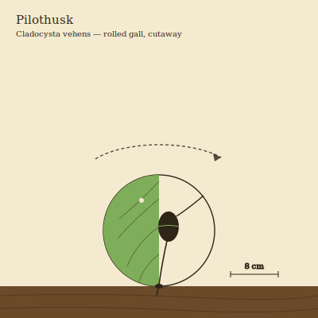

## Anatomy

A soft pear-shaped body the size of a thumb, sealed entirely inside a hollow green sphere of hijacked world-tree tissue 8–12 cm across — a gall it chemically forced the tree to bud around it as a larva. The gall is alive and photosynthesizes, and the Pilothusk taps its inner wall with a rootlet proboscis, drinking the sugars its own shell makes, so the animal is farmed by its prison. A single muscular tiller-limb, the only part ever exposed, protrudes through a basal pore to grip bark. No head; a belt of photoreceptive spots around the body's equator reads the green glow inside the gall, brighter on the sunward side.

## Behavior

It rolls. By shifting weight and planting the tiller, a Pilothusk tumbles its sphere across the canopy's photosynthetic bark at a slow walking pace, steering toward brighter patches where the shell makes more sugar. When two adults collide — frequent and deliberate — they lock apertures, exchange gametes, and roll apart; a larva hatches inside a fresh tree bud and immediately secretes the auxin analog that closes the bud around it into a new sphere. Outgrown or sun-cracked galls are abandoned, but being tree tissue they root where they fall and become new branchlets, so Pilothusks are the canopy's accidental arborists, pruning and grafting the world-tree as they live.

## Myth

Canopy-walkers hold that a Pilothusk is not a creature at all but a decision the world-tree has not yet finished making — an abandoned gall is a thought the tree chose to keep, a rolling one a thought still in motion. To have one roll across your path is warning enough: you are standing where something is about to branch.
