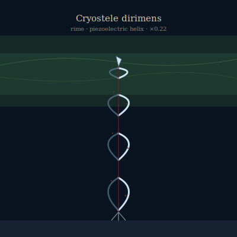

## Anatomy

A tapering helical spire of self-nucleated ice, 1.5–2 m tall, grown from atmospheric vapor around a brine-soaked mineral core. The ice is deliberately doped: the organism spins iron-oxide needles and windblown feldspar dust into each growth layer, aligning them along the helix so the column is piezoelectric — every auroral pulse that compresses it drives a current down the core, where endolithic sulfur-iron microbes use the juice to strip electrons from the mineral dust the spire has filtered from the thin air. There is no head, no mouth; the whole spiral is both lung and gut, and the only soft tissue is a wine-dark brine thread winding through the axis.

## Behavior

It moves only by growth, sublimating the sunward face and depositing on the dark face, so a mature cryostele rotates its helix a few degrees a week to track the auroral arc across the sky. It feeds continuously on whatever the upper winds jam into its crystal lattice — dust, microfrost, the occasional dead Aether plankton — and a single spire can filter a tonne of air across its lifetime. Reproduction is apical shattering: when a tip grows too tall for the wind shear at that altitude it snaps, and each shard that lodges in a crevice nucleates a new helix, inheriting the parent's microbial core in a sliver of brine.

## Myth

Rime-walkers say the cryostele spires are the Drift's ears, raised to listen to the aurora, and that a still night with no auroral song makes them weep brine — which the walkers collect as a salt that tastes of iron and ozone. To fell one is to deafen a piece of the sky.
