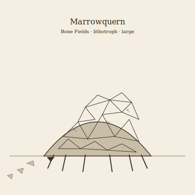

## Anatomy

A low, six-legged body with no skeleton of its own — instead a thick dermal carapace built entirely from calcium phosphate mined from the Bone Fields' fossils, each plate a re-fused fragment of some extinct species, so no two individuals share an armor plan. Beneath the mosaic lies a soft slate-blue mantle of muscle that secretes a weak acid to loosen fossil matrix from bedrock; six stout legs end in chisel-edged rasping hooves. A broad ventral grinding mouth-plate ingests whole fossiliferous rock, and the foregut is an acid bath where matrix dissolves and the liberated bone-mineral is re-precipitated along living sutures onto the carapace's growing edge.

## Behavior

Marrowquerns migrate the badlands in looping decades-long circuits, rasping fossiliferous strata loose, metabolizing the calcium phosphate, and exhaling pure silica sand as waste — their trails read as pale glassy scours across the chalk. Older plates flake and shed as the carapace thickens, re-entering the field indistinguishable from true fossil, so a measurable fraction of the Bone Fields is just shed Marrowquern armor. Solitary and indifferent to all but its own kind: where two querns cross paths they rasp each other's flanks to harvest rival calcium, a slow grinding duel that can last days and leaves both carapaces scarred with foreign bone.

## Myth

Bone Fields cartographers claim a Marrowquern's age is legible in the species stacked through its plates — the eldest carry fragments of creatures with no other record anywhere in the Drift, making the living animal a more complete archive than the strata themselves. To kill one, they say, is to burn a library no one can rebuild.
