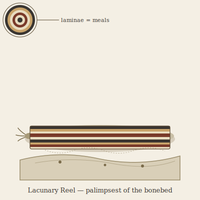

## Anatomy

A flattened, limbless body the length of a forearm, ventral sole and dorsal mantle over a soft hydrostatic core, with no eyes and only a paired chemosensory palp-cluster at the head end. The ventral sole secretes dilute hydrochloric acid; the dorsal mantle re-precipitates the dissolved hydroxyapatite as a laminated shell, one lamina per meal. Because each fossil species stains its lamina differently — iron-rich bone runs rust, manganese-bearing runs black, collagen-dense runs cream — a cross-section of an old Reel reads as a vertical column of the local bonebed: it is, quite literally, a walking stratigraphic core. It orients by taste of the substrate and by the faint remanent magnetism of fossil collagen, crawling the badlands on a slow chemotactic gradient toward the next extinct thing.

## Behavior

It lives to eat what is already dead. A Reel settles on an exposed fossil, anchors its sole, and dissolves a shallow trench over weeks, drinking the mineral slurry through a ventral groove and laying a fresh band on its back; it never molts, only accretes, so the oldest individuals carry hundreds of laminae and weigh more shell than flesh. Hermaphroditic pairs meet along shared fossil seams, exchange mantle slurry flank-to-flank, and each deposits a single calcite-coated egg-case into the marrow cavity of a hollow bone — the hatchling's first meal is the incubator that sheltered it. They cannot flee and do not fight; their only defense is that nothing else wants the calcite they are made of.

## Myth

Bone Field peoples read a Reel's bands the way other folk read cliff-faces, and an individual bearing a particular sequence is said to mark a species the Drift "wants remembered." To crush one is to murder a thing twice — first the animal, then every extinct creature layered in its back — so wayfarers step around them even when they lie across the only path home.
