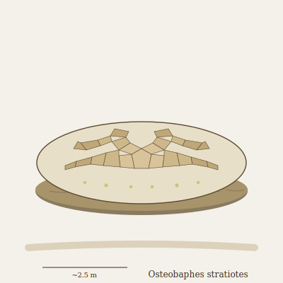

## Anatomy

A broad, flattened animal the shape of a low ottoman, two to three meters across, moving on a single muscular ventral sole like a terrestrial slug. The dorsum is not its own tissue but a living mosaic of re-precipitated bone — every fossil fragment the animal has ever dissolved is regrown as a tile of dense, isotopically-tagged apatite and cemented into a stratigraphic pavement across its back, oldest beds at the center, newest at the edges. Beneath the mosaic lies a thick chelating-acid gland that weeps through pores in the sole; the dissolved calcium phosphate broth is pumped up internal sinuses to the back, where it mineralizes overnight. There are no eyes. The sole tastes strata.

## Behavior

It glides across the badlands at the speed of a growing stain, leaving a pale etched track where fossil beds have been planed flat. Each individual's back is a literal stratigraphic column of the beds it has crossed — paleontologists of the Drift read an old Osteobaphes like a core sample, and prize "long-footed" individuals that have crossed an unconformity, their mosaics preserving fossil beds long since eroded from the landscape. Threatened, it floods the mosaic's underside with dissolved CO₂ from its broth and inflates a calcite-laced foam dome that hardens in seconds into a temporary shell; the dome is later reabsorbed. It reproduces by fission: when the back mosaic exceeds a critical mass, a wedge splits off, sole and all, and inherits half the stratigraphy.

## Myth

Bone-Field prospectors swear an Osteobaphes always rolls downhill toward the richest fossil bed within a day's glide, and follow old tracks to find new dig sites. They will not walk the etched trails themselves: the sole's acid lingers for weeks, and boot-soles are said to come away "soft as warm wax."
