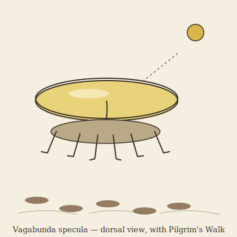

## Anatomy

Vagabunda is a shallow parabolic dish the breadth of an open hand, carried six-legged across the world-tree's crown. The dorsal shell is tiled in biogenic guanine platelets — a flat, near-perfect mirror that tracks the sun on a flexible neck-stalk. Beneath the shell, pressed to the canopy leaves, lives a millimeter-thick biofilm of symbiotic photoautotrophs: the creature's actual mouth. Vagabunda itself has no gut; it is a concentrating lens and a set of legs, and the film is what eats. Six hooked tarsi grip leaf-bundles; a thin ventral skirt of ash-grey chitin stops the wind from tearing the film free.

## Behavior

It settles, tilts the dish to focus light onto the film, and feeds for roughly two hours. The catch: concentrating that much sun leaks heat downward, and the leaves beneath scorch, brown, and stop transpiring — which collapses the humidity the film needs. So Vagabunda must uproot and walk to fresh canopy before it starves itself on the dead patch it made. A single individual leaves a dotted brown trail across the crown, never settling twice on the same leaf. At night it folds the dish edge-down to shed dew. Mating is a dish-clash: two adults angle mirrors at each other and the brighter reflection fertilizes the other's film with carried spores.

## Myth

Canopy-gardeners call the dotted scorch-trails **Pilgrim's Walks** and say Vagabunda is a splinter of a dead sun that fell into the Drift and now wanders the world-tree looking for a place to set down and die — but cannot, because it burns anywhere it rests. To see one at noon is to be reminded that even light can be a burden you carry until it ruins the ground beneath you.
