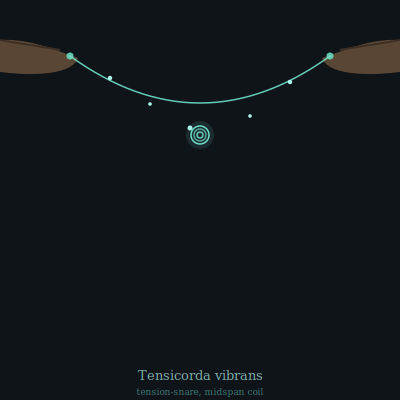

## Anatomy

Tensicorda is not an animal with a body so much as a single living line: a filament of contractile hyphae two to four meters long and barely a millimeter thick, strung taut between two anchors on the dangling world-tree roots of the upper Underglow. There is no head, no gut, no symmetry — only a continuous core of luciferin-rich fluid sheathed in spiral muscle, with a sparse nerve net running the length and brightest at the two extensible root-feet that crawl it slowly from anchor to anchor. The filament glows a faint teal along its whole length, brighter where it has fed, and at its midspan carries a permanent tight helix — the catching coil — that snaps shut on contact.

## Behavior

It hunts by hijack. Through its root-feet it secretes a mimic of the Underglow fungi's own fruiting signal, forcing the mycelium along a corridor beneath it to glow brighter and more rhythmically — a false avenue of light that small fungal-navigating flyers and gliding canopy-fallers follow straight into the filament. A brush triggers a millisecond contraction: the whole line shortens by a third and the midspan coil whips into a tight knot around the prey, which is then digested *in place* over hours, enzymes weeping outward along the contact and absorbate drawn back osmotically through the fluid core. Tensicorda repositions by crawling one root-foot at a time, keeping itself taut; it never crosses another individual's line, instead bowing away and re-anchoring, so mature Underglow groves hold whole parallel *fields* of glowing strings at slightly different heights. Reproduction is longitudinal fission: a thick, well-fed filament splits lengthwise into two thinner ones that each grow back to span, and the pair crawls apart over a few weeks.

## Myth

Underglow trappers pluck a Tensicorda like a harp string and swear each one holds a single low note no two alike; the deepest tones are said to be lines that have digested a human, and the cord-singers of the lower groves tune their instruments only to those.
