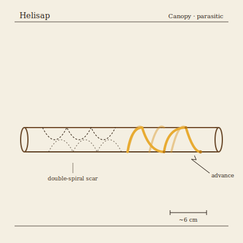

## Anatomy

A Helisap is a living helical band of parasitic cambium, a translucent amber tube four to nine centimeters long wrapped two or three turns around a world-tree branch with no head, gut, or symmetry axis. Its inner face bears a ring of tap-roots that pierce the host phloem; its outer face is a hard, photosynthetically inert rind stippled with lenticels. Seen against the bark it reads as a glowing spiral of running sap, the host's sugar stream diverted through the body wall before returning to the branch. There is no nervous system — orientation is purely chemotropic, the coil reading the world-tree's auxin gradient through its tap-roots and steering toward the youngest, richest meristems.

## Behavior

It advances by screwing itself along the branch: growing fresh tap-roots at the leading edge while the trailing edge dies and rots free, leaving a characteristic double-spiral scar (the live coil and the dissolved track, wound around each other). A single Helisap moves perhaps a meter a season and never leaves its natal branch unless forced. When two meet they interlock coils and exchange cambial cells across the graft, a mating with no gametes, just a tissue swap, then constrict in tandem until the branch is girdled and snaps under its own weight. Each coil rolls off the broken end onto a neighboring branch as a new colonist, the fracture itself being the act of reproduction; a branch can carry a dozen Helisaps before it dies, and the world-tree sheds the worst-affected limbs in autumn gales, seeding new parasites across the Canopy.

## Myth

Canopy-folk read the double-spiral scars as the world-tree's own script and refuse to cut a living coil free, to do so being to silence a sentence mid-word. A crown bearing many spirals is said to be composing something, and the eldest rangers swear they can nearly read it.
