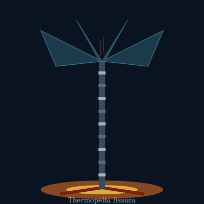

## Anatomy

A rigid mineralized stalk, 1-2 m tall, anchored at its hot foot inside a 300°C fissure. The stalk is a living thermocouple: alternating rings of conductive and semiconductive tissue convert the temperature differential straight into an electrochemical potential, bypassing conventional metabolism entirely — no mouth, no gut, no digestive enzymes. At the cold end the stalk opens into a broad, dark metallic-foil sail that radiates heat into the ambient 4°C water, maximizing the gradient it feeds on. The whole body is built of precipitated sulfide laminae, grown one band per year.

## Behavior

Larvae are motile heat-seeking ciliated spheres that home on the faint IR signature of new fissures; those that miss a vent die within hours. Adults are immobile and reproduce only during sustained high-flow eruption events, releasing larvae on the superheated plume. Competition is by overgrowth: a larger sail shades a neighbor's stalk, collapsing its gradient until the loser starves and its bands slough off. Specimens of 400+ rings have been counted.

## Myth

Vent-dwellers harvest dead stalks as "lightning-bones," believing a struck fissure is where the world's blood cools and solidifies. Some vent-cults implant a living ring into a prosthetic limb, claiming the borrowed gradient lets them dream of the deep.
