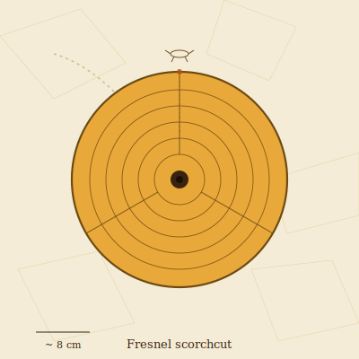

## Anatomy

A coin-shaped opaline shell the size of a palm, set flush into the glass desert like a manhole cover. The shell is a living Fresnel lens — concentric stepped grooves of secreted silica that the creature grinds smooth each dawn with a waxy mantic secretion. Beneath the lens hangs a translucent sac of organs; a single retractable siphon emerges through the central pore when prey is charred above. There are no eyes. Instead, the lens body itself images passing silhouettes onto a ring of photoreceptive tissue lining the sac's equator, so the whole shell is both cornea and retina.

## Behavior

Sessile through the midday burn, the scorchcut slides on a muscular foot at dawn to re-center on the day's sun arc, leaving a faint polished scratch-trail across the glass. At peak insolation it focuses sunlight to a point roughly a hand's breadth above its shell, igniting the small silicate-walking arthropods that cross its kill-zone; the siphon then extends to drink the carbonized residue. Reproduction is radial fission: after years of growth the lens splits along three sutures into wedge-shaped planulae that crawl away to settle and grind their own shells.

## Myth

Wastes-travelers call the scratch-trails "the sun's handwriting" and read their direction for omens of heat and dust. Standing too long over a scorchcut is said to leave a small burned mark on boot soles — the sun's signature, confirming you are real enough to hurt.
