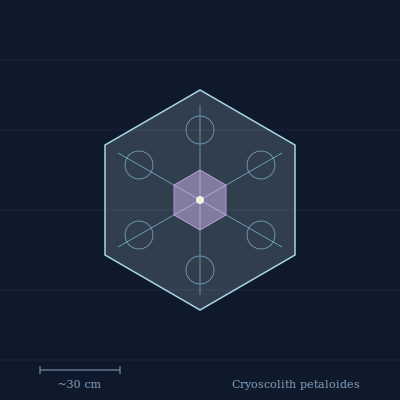

## Anatomy

A flat hexagonal membrane some thirty centimeters across, and not a membrane of tissue but a single self-templated crystal of biogenic ice grown on a scaffold of ice-nucleation proteins. The crystal is not solid: it is a defect-engineered photonic lattice, a forest of vacuum-lined brine channels arranged in rows that scatter the Rime's thin light into an iridescent six-petaled pattern. There is no gut, no nervous system, no symmetry beyond the hexagon; the only living matter is a monolayer of cells along the lower face, which secretes the nucleator proteins and pumps brine to reshape the lattice from within.

## Behavior

Cryoscoliths hang at the boundary where Rime ice meets the rarefied upper atmosphere, oriented face-on to the dim polar light. They feed by photonic concentration: the lattice focuses light onto pigment-protein patches that drive a cold-adapted photosynthesis, while the brine channels condense and absorb aerosol organics drifting up from the warmer Drift below. Movement is by melt-grow — cells on the trailing edge secrete antifreeze protein and dissolve the crystal locally, while the leading edge re-secretes nucleator, and the whole membrane inches across the frost over the course of hours. To reproduce, an adult raises the resonant frequency of one petal until a corner shatters free; the fragment carries the nucleator template and, if it lands face-up on fresh ice, grows a new lattice within a day.

## Myth

Skyfarers who cross the Rime call the iridescent flashes "the petals of the gate" and hold that a Cryoscolith grown through six full hexagons without shattering has memorized a path between two landmasses. To touch one, they say, is to carry that path home in your bones: afterward you can find north blindfolded for the rest of your life.
