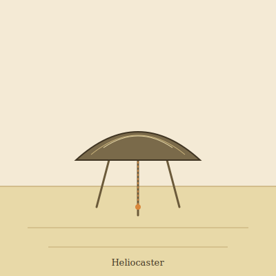

## Anatomy

A flat parabolic dish of dichroic glass, 40–60 cm across, held aloft on three sintered-alumina stilts half a meter tall. The carapace is grown by vapor-depositing hundreds of alternating silica and iron-oxide nanolayers during peak heat, producing a mirror that focuses the Waste's sun to a sub-millimeter point just ahead of the feet. A ceramic ventral lip and a fiber-optic spine pipe that focused beam into a gut chamber lined with photoferrotrophic symbionts, which use the light to dissolve molten silica into a metabolite brine. There is no head, no eyes; the organism navigates by reading polarized skylight through the carapace itself, treating the dish as one vast compound lens.

## Behavior

Active only at zenith. A heliocaster walks a slow, ruler-straight furrow across the glass flats, melting and drinking the silica ahead, leaving behind a refrozen groove of optically pure glass that phototrophic films colonize within days. It never crosses its own trail, recognizing the groove's altered refractive index, and will arc widely to avoid another individual's path. At dusk it folds its legs and settles flush to the glass; the carapace flips to a cold mirror and it enters torpor until the next noon. Reproduction is by rim-budding: a miniature dish detaches, catches a thermal updraft, and lands glass-down elsewhere to grow its own stilts.

## Myth

Glass-waste nomads follow fresh heliocaster furrows as roads of "the Sun that walked," trusting the creature to find water sealed beneath silica sheets. A dead heliocaster's carapace is prized as a burning-lens; elders warn that to keep one indoors is to invite the Waste's noon into your sleep.
