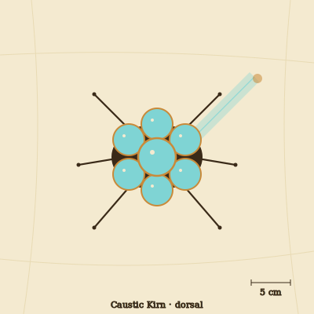

## Anatomy

A low, palm-sized body enclosed in a carapace of self-secreted fused silica, shaped as a cluster of seven meniscus lenses — one central, six peripheral — mounted on a chitin underframe and six stilted, glass-shard legs. The lenses are not ornament: each focuses sunlight onto an internal array of dark fluid bladders that both drive a photo-thermal metabolism and weaponize light. By micro-tensing the silica muscles it can steer a moving hot-spot — a "caustic cast" — onto the sand ahead, focused to a pinhead that exceeds 400°C.

## Behavior

An ambush hunter. It half-buries at midday, angles its carapace to the sun, and walks the caustic cast out across the glare onto passing prey — glass-shelled mites, sun-drunk skitters — heat-shocking them in place. It then strides forward, opens a ventral slit, and drains the cooked contents. Mate recognition is by projected light: two kirns trade caustic shapes at noon, and a matching harmonic of focal lengths is consent. Eggs are laid inside a single fresh-cast lens, which anneals in the afternoon heat into a protective dome.

## Myth

Glass-waste nomads call the cast "the fallen star's finger" and believe each kirn carries a sun-fragment that could not climb back to the sky. To step across a cast-line is to be marked for the sun to take, so travelers detour around any glittering track in the sand at noon.
