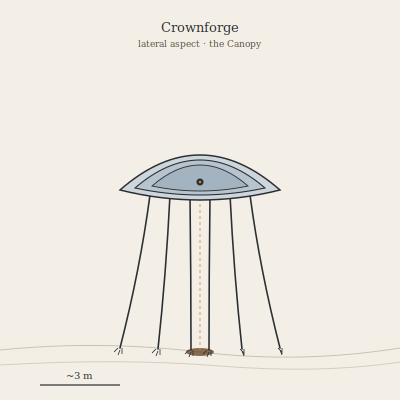

## Anatomy

A large stilt-legged walker — six legs three meters tall, each tipped in a bundle of needle-claws that grip the world-tree's photosynthetic bark without puncturing its sap-veins. The body is a shallow parabolic dish of silvered chitin backed by layered guanine crystals, optically smooth to within a wavelength; the dish's underside is a black absorptive sac where a rasping radula and a thermal gut meet. There are no eyes. A pinhole of dark photoreceptor tissue sits at the dish's geometric focus; the feet carry thermotactic hairs that read the canopy's heat-mosaic.

## Behavior

It grazes by solar concentration. Pausing over a patch of bark, the Crownforge tilts its mirror to focus noonlight onto a coin-sized spot, holding it until the photosynthetic tissue's structural polymer softens and caramelizes — then rasps the cooked layer free and funnels it into the gut. External digestion by sunlight. It moves only at dawn and dusk to avoid overheating its own mirror, and is fiercely solitary: two Crownforges meeting on a good sun-patch align dishes and flash coded specular patterns until one concedes the territory. Mating is the same display, prolonged, with both dishes tilted to throw light into each other's focal pinhole.

## Myth

Canopy-walkers say a Crownforge that lives a century anneals its mirror into a single flawless lens, and that anything held at its focus at true noon is not burned but *recorded* — its shadow fixed permanently into the world-tree's bark as a dark, sun-fast stain. Pilgrims leave silhouettes of the dead there on purpose.
