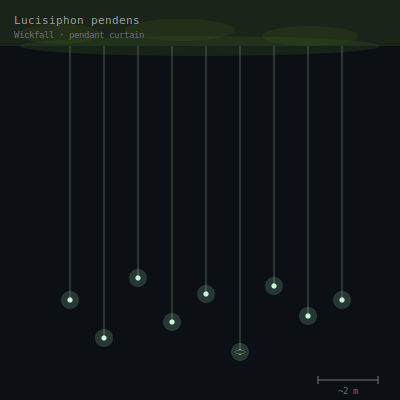

## Anatomy

Wickfall is a colony of identical modules strung from the canopy's underside down into the Underglow — each module a hair-thin (0.4–0.7 mm) chitinous tube four to eight meters long, with no head, no gut, and no nervous system of its own. The upper end parasitizes the canopy's bioluminescent fungi, threading between their hyphae to steal luciferin-rich sap; the lower end terminates in a pendant droplet, a bead of that stolen sap held by surface tension and laced with the creature's own digestive enzymes. The tube wall is a single layer of contractile cells around a hydrostatic core — a slow muscle with no skeleton. Biologically it is neither animal nor fungus but a stable chimera of both, and a single module never occurs alone: dozens hang in parallel curtains, each droplet pulsing in slow phase with its neighbors via pressure waves in the shared canopy mat.

## Behavior

It hunts by fraud. The pendant droplets glow with stolen canopy light, and the Underglow's phototactic fauna — spore-moths, gnat analogues, glow-seeking mites — fly up into the curtain and stick. Contact trips a pressure reflex: the tube's cells contract in a peristaltic wave, reeling the catch upward at a few centimeters per second, and the prey is delivered into the canopy fungal mat where symbiont and host digest it together over days. Modules that catch nothing for weeks over-ripen: the droplet swells, detaches, and falls; on striking a lower branch it seeds a new hyphal network that grows back upward toward any canopy above, so a Wickfall colony spreads both across a single ceiling and down through successive tiered drifts. Curtains are spaced to avoid tangling — a tangled curtain contracts incoherently and starves.

## Myth

Underglow travelers call the curtains "the hanged lanterns" and steer by the rule that the brightest patch is the deadliest: a luminous curtain marks the canopy's richest theft and the fastest, best-fed traps. Sailors who have watched a crewmate brush a curtain say the tubes do not pull — they *wait*, and the light does the pulling.
