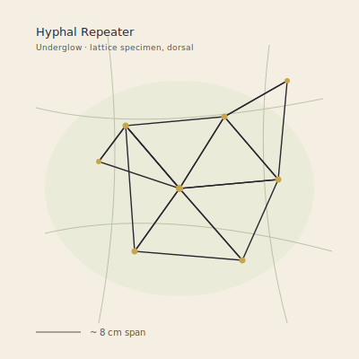

## Anatomy

The Repeater has no body in the vertebrate sense — it is an open triangulated lattice of dry, dark chitinous threads, fist-sized when grown, with no gut, no head, no symmetry axis. Each thread is a hollow capillary lined with absorptive villi and a ring of microscopic stylets at every node; the nodes are the only "organs," pea-sized knots of nervous tissue that both pierce host hyphae and house a sparse photosensitive pigment. The lattice is its anatomy and its mouth at once. A single individual is more topological than material: cut a thread and the mesh reroutes; the creature is the connectivity, not the fibers.

## Behavior

It drifts down from the canopy on still air, lands across a fungal colony, and slowly tenses its threads until the stylet nodes puncture the host's mycelial strands — then it feeds by direct trans-wall absorption of cytoplasm, never moving again. The strangeness is in what it does to the network: each tap also reads the chemical-electrical pulses the colony uses to coordinate fruiting, and a Repeater with multiple taps re-broadcasts a delayed, distorted echo of those pulses back into the mycelium. Colonies tapped by a Repeater fruit out of sync — early, late, in the wrong quadrant — which is precisely how the Repeater reproduces: the mistimed fruiting bodies shed spores that the lattice intercepts, bundles, and carries on updrafts to seed new colonies and new Repeaters elsewhere in the Underglow. It is a parasite that profits by scrambling its host's clock.

## Myth

Underglow foragers say a tapped forest "stutters" — fruiting where it shouldn't, glowing in the wrong rhythm — and read the stutter as the forest trying to remember a song it has forgotten. To find a Repeater lattice is considered bad luck for a harvest but good luck for a mapper: the mistimed fruiting marks the boundary where two fungal colonies meet, which no one can otherwise see.
