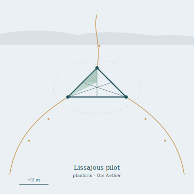

## Anatomy

A rigid equilateral frame of self-secreted silica-aerogel lattice, two meters across, massing under a kilogram. Three trailing filaments extend from the vertices, each a tensioned chitin string driven at ultrasonic frequencies by piezoelectric root-nodes; the interference of the three waves sets up Lissajous pressure-nodes in the thin air that the frame rides, tacking like a sailboat on no wind at all. The skin between lattice struts is a one-cell-thick photosynthetic film, secondary to its real diet. It has no head, no eyes — it feels the sky through filament tension and the air's acoustic impedance, and orients by the planet's magnetic gradient read off the piezo-currents.

## Behavior

The pilot drifts the open Aether between landmasses, tacking silently on thermal updrafts for weeks at a stretch. Every few days it halts, charges its filaments to several thousand volts, and condenses a rime of aerosolized mineral, ice, and high-altitude microfauna onto them, then reels each filament through a slit at its vertex to swallow the harvest whole. Mating is acoustic: two pilots tune their filaments to a shared harmonic and spiral around each other for hours, exchanging graft-fragments that bud a new frame within a season. Storms shred them; shattered lattice is found pinned to the undersides of landmasses, still faintly ringing.

## Myth

Aether-crossers hold that the pilots are the souls of the Drift's first surveyors, who ascended to map the gaps between landmasses and forgot how to descend. The harmonics they sing at dusk are said to be routes no living thing has flown, and a pilot that turns to follow a ship is an omen that the vessel is already lost.
