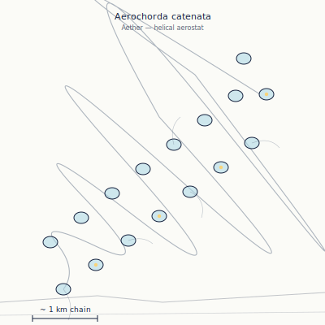

## Anatomy

Aerochorda is not one animal but a kilometer-long helical filament of several thousand gas bladders, each the size of a closed fist, strung on a single tensioned connective thread and twisted into a slow left-handed spiral that the thin Aether wind keeps permanently spinning. There is no head, no gut, no symmetry axis other than the helix; each bladder is an independent zooid wrapped in a translucent chitin film that both photosynthesizes the Drift's ambient atmospheric luminance and electrostatically snags aeroplankton onto mucus threads trailed between neighboring coils. The whole chain holds a net static charge on the order of kilovolts, generated by friction with the rarefied air, and reads the Drift's faint atmospheric potential gradient through piezoelectric hairs on every bladder — navigation is electrosensory, not visual.

## Behavior

It tacks across the open sky like a sail with no ship: by adjusting each bladder's gas volume (secreting or reabsorbing hydrogen produced from water photolysis) it changes the local buoyancy of the chain, bending the helix to angle the wind and steer toward richer aeroplankton scents or away from shear zones. Reproduction is by dissociation — when a crosswind tears the chain, each fragment of a hundred or more bladders regenerates the full helix from its broken end over weeks, growing new zooids in the handedness of the parent; a single Aerochorda can thus seed dozens of clones across a storm. Dead chains do not fall: they discharge, lose buoyancy slowly, and descend over months as a silvery rain of empty bladders that the lower biomes call sky-litter.

## Myth

Skyfarers crossing between landmasses know Aerochorda as "the looms" and hold that the great helices are the stitches holding the Drift's landmasses in suspension; to fly through one is to hear the world breathing. A chain that crosses your bow is a reading — coiling tight means a storm behind it, stretching long means fair air ahead — and to cut one deliberately is said to loosen a stitch the Drift will spend a generation re-knitting.
