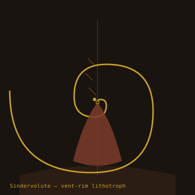

## Anatomy

A fist-sized gastropod-analogue coiled in a logarithmic spiral of biogenic pyrite, grown not secreted: the animal electroplates dissolved iron and sulfur from vent brine onto a chitin-protein template, so the shell is conductive and warm to the touch. The single muscular foot is bare of armor and densely innervated, reading micro-temperature gradients down to thousandths of a degree. A rasping radula of magnetite teeth grinds sulfide crust from chimney walls.

## Behavior

It creeps the razor-thin thermal band at the rim of active fissures, orienting its spiral perpendicular to convection so the shell acts as a chimney itself, drawing oxidizing water over gill filaments lining the aperture. It feeds by scraping pyrrhotite crusts and dissolving them in acid saliva. When a vent cools, the operculum seals with a mineral plug and metabolism drops to near-zero; Sindervolutes have been recovered alive from extinct chimneys dated to three drift-ages prior, resuming feeding within hours of being placed on a live vent.

## Myth

Vent-dwellers believe each Sindervolute holds a single memory of the Drift's making, encoded in the pitch of its spiral, and that reading all the spirals in order would reconstruct the world's first word.
