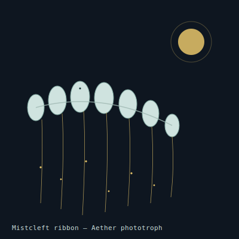

## Anatomy

A colonial siphonophore-analogue drifting the open sky: a chain of several hundred chitin-film pneumatophores, each a translucent bladder the length of a forearm, strung along a shared nerve-cord like beads on a slack wire. The upper wall of every bladder carries a hygroscopic glycoprotein varnish that scrubs water vapor from thin air; beneath it, a magnesium-porphyrin pigment photolyzes the trapped water into hydrogen (retained in the bladder) and oxygen (vented through a one-way pore). The colony's lift is thus sunlight made buoyant. Beneath the chain dangle hundreds of meter-long filaments, each coated in a weakly electrostatic mucus that snares aerial plankton — spores, mites, the larvae of canopy insects — and wicks them up to a shared digestive gutter.

## Behavior

By day the ribbon rides the high thermals, photolyzing furiously, its bladders drum-taut and silver; at dusk, hydrogen leaks passively through the chitin film faster than it is produced, and the colony sinks into the moist, calm air below the Aether, where plankton is densest and the filaments fish the dark. It can vent a bladder intentionally to dodge storms or to descend out of a jetstream that would carry it off the Drift. A ribbon foundered on a landmass re-inflates over the next clear dawn and lifts off again. Reproduction is by pinching off a tail-end bladder, which drifts away and buds a new colony clonally.

## Myth

Aether-crossers read the ribbons as compasses: a ribbon at dusk descends toward the nearest land for moisture, so following one down brings you home. The vented oxygen-pulse at dawn is said to be the world-trees exhaling, and a ribbon that never rises again is read as a tree having died somewhere below.
