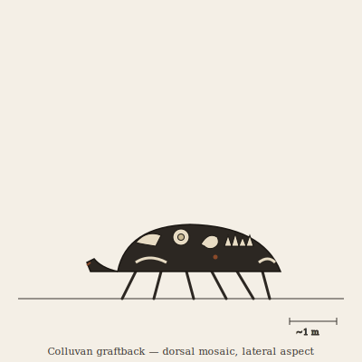

## Anatomy

A low-slung six-legged walker the size of a large dog, built around a single innovation: it does not excrete the calcium phosphate it digests. A broad grinding plate — a chitin-reinforced radula studded with recycled fossil teeth — pulverizes exposed bone-bedrock into a flour that a two-chambered gut leaches for residual organics locked in the mineral matrix since the Drift's deep past. The stripped apatite is pumped, as a colloidal slurry, to a row of dorsal deposition pads running spine to hip, where it re-precipitates cold onto whatever fossil fragments the creature has pressed into the pads' living cement. The result is a carapace that is less an armor than a growing collage: a jaw here, a vertebra there, the spiral of someone else's shell, all fusing into a single palimpsest surface the graftback did not grow but accumulated. Beneath, the body is soft, dark, and conspicuously unarmored — all its defense is on loan from the dead.

## Behavior

It grinds a slow, linear trench across the badlands, head down, working a fossil seam for weeks before moving on, leaving a pale scar of powdered stratum behind it. Threatened, it hunches onto its belly and presents the mosaic: a wall of embedded teeth and processes it never made and cannot regrow, shed once and gone. Molting is annual and catastrophic — the entire dorsal collage detaches as a single brittle shell, which the graftback abandons where it falls; these hollow mosaics become microhabitats for burrowing mites and the acid-sealed larvae of Taphocastus. Mates recognize each other by the stratal signature of their carapaces: two graftbacks from the same fossil province wear the same extinct species and will not mate, reading it as kinship.

## Myth

Bone-Field scavengers call the abandoned mosaics "graveyards that walked" and will not shelter in them, believing the graftback carries the unfinished business of every species fused to its back. To find a fresh cast shell is read instead as a gift: the dead, the saying goes, have agreed to stay behind so the living can pass.
