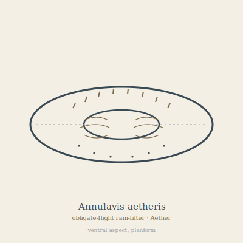

## Anatomy

A living ring: a muscular annular wing two to three meters across, hollow at the center like a torus stretched thin. A tense elastic membrane drums over a cartilage hoop; the leading edge is slit with intake gills that spiral inward through the body's thickness, and the trailing edge exhales through a band of pressure-sensing pits — the whole animal is essentially a ramjet with no head, no eyes, no gut. Both the inner and outer surfaces of the ring generate lift, so the aperture itself is the wing. Skin is silver-grey, faintly nacreous, scored with the spiral tracks of the filter-gill.

## Behavior

It never lands. Without forward airflow the gill collapses and the animal asphyxiates in minutes — stillness is death. It patrols the flanks of suspended landmasses, riding thermals up the warm stone faces and then dive-looping through the thin upper air to feed and breathe in the same stroke, straining wind-borne spores, canopy pollen, and high-drifting mites from the column. Mate recognition is by air-pressure signature: two rings fly tangentially through each other's apertures, exchanging gamete packets glued to the trailing edge. Fertilized eggs are released as adhesive spore-mist into updrafts that carry them back down to the Canopy, where crawler juveniles hatch, feed, grow a hoop, and launch themselves off the edge on the first strong thermal.

## Myth

Aether-crossers consider it ill luck to pass through a ring's aperture — they say Annulavis was once a traveler who forgot to keep breathing and is now condemned to draw breath forever by moving. Skiff-pilots trail a lure-line of bright spore-mist behind their vessels to tempt a ring into flying wingman, believing its presence smooths the wind for a few hundred meters.
