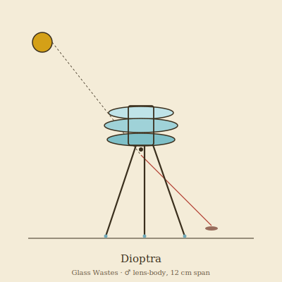

## Anatomy

A fist-sized chitinous frame on three splayed glass-spurred legs, carrying a vertical stack of birefringent crystal discs the animal grows itself by precipitating dissolved silica from ingested sand. The discs are held in precise parallel alignment by muscular gimbals, so the whole stack functions as a single tunable lens. There is no mouth; the front face of the lowest disc is dimpled into a focal pit. The creature's color is whatever it is currently refracting — at rest, a faint prismatic smear; in ambush, a hard white point of concentrated sun.

## Behavior

Dioptra hunts by orienting the sun behind it and tilting its disc-stack until the focal pit ignites a point on the substrate in front of it, a pinprick of five-hundred-degree heat. Wastes arthropods, drawn to the bright scorch-mark, are incinerated mid-stride; the Dioptra then advances, lowers its body over the char, and absorbs the residue through the ventral cuticle. It must relocate every few hours as the sun moves, walking on its three legs in a slow clockwork rotation that keeps the lens aimed. Reproduction is violent and terminal: when a disc fractures under thermal stress, the shard roots in the sand and germinates a new frame, while the parent often dies of misalignment.

## Myth

Wastes-travelers call the moving pinpoint "the eye that does not blink" and read its path as a sentence being written across the dunes. A Dioptra found burnt-out and legless is said to mark the grave of someone who walked toward the light against advice.
