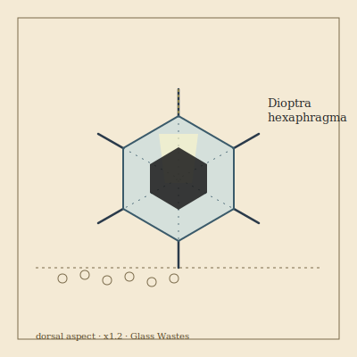

## Anatomy

A flat hexagonal disk the width of a spread hand, built of alternating laminae of biogenic chitin and crystalline silica drawn from the dust it eats, making the whole body a real converging lens. The ventral face is a black pigment mat riddled with capillary pores; the dorsal face is optically polished smooth. Six short facet-legs of clear biogenic quartz hinge at the rim, used only to tilt. It has no eyes: it reads the sun's position through differential heating of six thermal pits spaced around its edge.

## Behavior

By day it tracks the sun, tilting on its legs to focus light through its body onto the glass-sand below, flash-heating a pinhead pit to near nine hundred degrees and thermally cracking feldspar into soluble silicates it then wicks up through the ventral mat. It migrates a few meters a day, leaving a dotted trail of melted craters. At dusk it lies flush and becomes invisible: the lens projects the ground behind it forward, a near-perfect cloak from any angle steeper than forty degrees off vertical. Mating is lens-coupling — two disks align face to face and trade silica-sperm packets by pulsed focused light, each burning a tiny constellation of receipt-marks into the other's ventral mat.

## Myth

Glass-Waste nomads navigate at midday by following its pit-trails, calling the dots "the sun's footprints." To tread on one unseen is said to brand the sole with a permanent hexagonal burn — the sun remembering exactly where it was touched.
