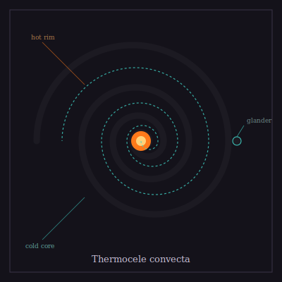

## Anatomy

A sessile coil that grows as a logarithmic spiral of biogenic pyrite, the whole body a brittle black chimney some forty centimeters across, anchored so that its outer rim sits in vent water near two hundred degrees and its inner terminal dips into the cool brine just outside the fissure's plume. The tube wall is double: a hot outer leaf of precipitated iron sulfide and a cold inner leaf, between which two immiscible fluids circulate — a dense metal-sulfide brine sinking along the hot face, a light hydrocarbon froth rising along the cold. There is no heart; convection is the heart. At the narrow interface where the fluids pass each other in counter-current, a sheet of metalloprotein membranes harvests the redox gradient and drives the cell's chemosynthesis directly, no light, no gut, no mouth.

## Behavior

It grows by precipitating its own wall from the vent fluid it processes, adding one whorl per season and slowing as the spiral chokes its own thermal access; an old Thermocele is a tight clock-spring of nested coils, the inner ones starved and dead, only the outermost rim still metabolizing. Reproduction is budding: from the cold rim, pressurized gas-filled capsules — glanders — detach and ride the buoyant plume up into the Drift's atmospheric sea, their pyrite shells dissolving slowly in the thinner fluid until, settling onto a fresh fissure miles away, they unseal and the spiral begins again. It does not move, but it migrates across generations: a lineage is a chain of plume-rides, each colony founding the next on whichever landmass the vent-currents carry its glanders to.

## Myth

Vent-divers call it "the cold engine" and swear a live coil, held in the palm, will keep a diver's blood warm for an hour on the strength of its circulating fluids alone — though every hand that has tried it has come back frostbitten where the pyrite touched skin. They say the glanders are the Drift's first prayers, rising from the deep dark to be answered as new land.
