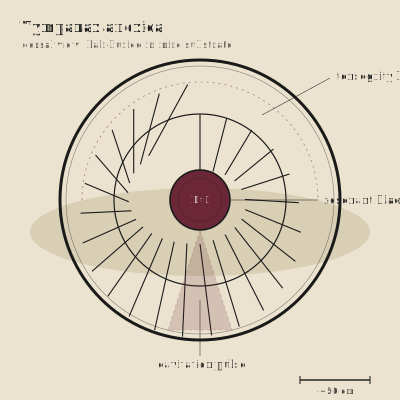

## Anatomy

Tympanax is a flat cartilaginous wheel half a meter across with no front, back, or gut — a tensegrity ring of forty-odd pre-stressed spokes braced against an outer hoop, all under compression, with the only soft tissue a gas-filled bladder clamped at the hub. It lies half-buried in the anoxic muck, hoop on the substrate, spokes singing like a drum-head under tension; the dense Mire water conducts vibration so well that the whole ring functions as a phased-array ear, triangulating the churning of burrowing detritivores meters away through rot that no eye could penetrate. There is no mouth: prey is killed at range by a focused low-frequency pulse fired from the hub bladder, which contracts like a pistol-shrimp's claw and drives a cavitation cone that liquefies tissue in a hand's-width column, after which the wheel walks itself over the wound and absorbs the slurry through the spoke lattice.

## Behavior

It is immobile for days at a time, tensioned against the muck, listening; when a pulse lands it drags itself forward on alternate spoke-pairs in a slow ratcheting roll, the hoop rotating around its own hub like a tire being walked by hand. Reproduction is structural: when a heavy animal steps on a Tympanax and snaps two or more spokes, the wheel does not die — it splits along the fracture into two tensioned arcs, each of which regenerates the missing half-ring over a season, so a single individual becomes two over the course of a bad year. Mire-folk trail-finders know that a place with many half-moon Tympanax is a recent crossing-ground of something large and heavy moving through the swamp.

## Myth

The Mire-folk call Tympanax "the deaf man's ear" and say it hears what the dead are still trying to say through the muck — every pulse it fires is a question put to a corpse, and the answer is the corpse coming apart. To find one intact beneath your boat is luck; to find one split is a warning that something bigger than you has already passed this way.
